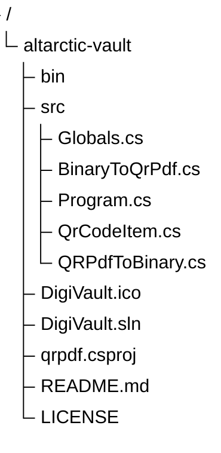

# altarctic-vault
The DigiVault<sup>>&reg;</sup> is a OpenSource APL 2.0 licensed application for preserving source code in PDF for long archiving purpose. This application is inspired from GitHub Arctic Vault project. However since 2D Boxing barcode used in Arctic Vault is proprietary IP protected mechanism this application uses simple Version 40 QR Code with Binary Data and Lower error recovery settings to accommodate large bytes in a single QR. The application uses all open source libraries such as PdfPig, ZXing.Net and SkiaSharp to accomplish this. The application also supports restoration mode in which it recovers the original binary artifact from the PDF file. The application has only been tested on Windows<sup>&reg;</sup> but should be able to run on Linux OS as well. The application has been developed using DotNet core 9.0. The rest of the document contains the documented source code of this application.

## THE Project
Since this is a .NET Core application obviously you need to have .NET Core 9.0 installed on your machine. A Good IDE is also required to quickly navigate across the source code. The application also depends on couple of third party Open Source libraries so its important you add those packages. The libraries used and command to add them in project is as shown below.


| Library | Version | Command |
| ------- | ------- | ------- |
| ZXing.Net | 0.16.11 | <code>dotnet add package ZXing.Net --verson 0.11.11</code> |
| ZXing.Net.Bindings.SkiaSharp | 0.16.22 | <code>dotnet add package ZXing.Net.Bindings.SkiaSharp --verson 0.16.22</code> |
| SkiaSharp | 3.119.2 | <code>dotnet add package SkiaSharp --version 3.119.2</code> |
| PdfPig | 0.1.14 | <code>dotnet add package PdfPig --version 0.1.14</code> |
| System.CommandLine | 2.0.7 | <code>dotnet add package System.CommandLine --version 2.0.7</code> |

The source code organization of the application is as outlined below



## Usage
The tool offers two modes

 1. **Digitization** mode - In this mode the tool reads the supplied binary file QRTizes it and puts the resulting PDF in the specified folder. The name of the PDF is same as the name of the file being degitized. The command takes two arguments
     - The first argument is a full path and name of the binary file to be QRTized
     - The second argument is a full path of the folder in which the QRTized PDF is to be placed.

**Sample Command**
```
DigiVault digitize <Full_path_to_Binary_Source> <Full_Path_of_Output_Folder>
```

 2. **Restoration** mode - In this mode tools reads the supplied QRTized PDF and recreates the original binary and finally puts the restored binary file in the spcified folder. The command takes three arguments.
    - The first argument is a full path and name of the QRTized PDF file
    - The second argument is a full path of the folder in which the restored binary is to be placed.
    - The last argument is a optional argument which identifies the extension of the restored binary file.
**Sample Command**
```
DigiVault restore <Full_path_to_QRTized_PDF> <Full_Path_of_Output_Folder> <Extension>
```   
    
